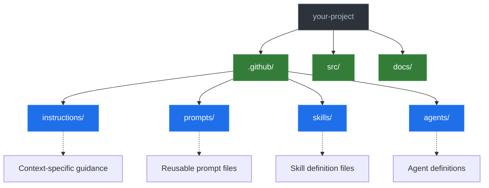

# AGENTS.md

<!-- 
This is the DISTRIBUTABLE AGENTS.md template.
Teams installing this starter kit will receive this file.
Customize the content below for their project.
-->

Guidelines for AI agents and human contributors working in this repository.

## Repository Structure

<!-- Update this diagram to reflect your project's structure -->



## File Hierarchy

This project uses a four-tier hierarchy for AI agent guidance. See [ADR-001](https://github.com/adhocteam/activate-copilot/blob/main/docs/dev/adrs/ADR-001-agent-instructions-skills-files.md) for details.

| Tier | Location | Scope | Invocation |
|------|----------|-------|------------|
| 1 | `AGENTS.md` | Project-wide | Always active |
| 2 | `.github/instructions/*.instructions.md` | Context-specific | Glob pattern match |
| 2 | `.github/prompts/*.prompt.md` | Task-specific | On-demand via `/command` |
| 3 | `.github/skills/[name]/SKILL.md` | Procedural | On-demand |
| 4 | `.github/agents/[name].agent.md` | Persona + capabilities | Explicit selection |

## Core Principles

### VS Code Customization Primitives

This project's file structure aligns with VS Code's built-in [agent customization](https://code.visualstudio.com/docs/copilot/copilot-customization) system. VS Code includes a built-in `agent-customization` skill that understands these file types natively.

| Primitive | Location | When to Use |
|-----------|----------|-------------|
| Workspace Instructions | `AGENTS.md` | Always-on, applies everywhere |
| File Instructions | `.github/instructions/*.instructions.md` | Automatic via `applyTo` patterns |
| Prompt Files | `.github/prompts/*.prompt.md` | Single focused task, invoked as `/command` |
| Agent Skills | `.github/skills/[name]/SKILL.md` | Multi-step workflow with bundled assets |
| Custom Agents | `.github/agents/[name].agent.md` | Specialized persona with tool restrictions |

To invoke a prompt, type `/` followed by the prompt name in the chat input (e.g., `/code-review`, `/create-adr`).

### Commit Message Conventions

Use [Conventional Commits](https://www.conventionalcommits.org/):

```text
type: description

[optional body]
```

**Types:** `feat`, `fix`, `docs`, `refactor`, `test`, `chore`

### Code Quality

<!-- Customize these principles for your project -->

- Write tests for new functionality
- Follow language-specific conventions (see instruction files)
- Keep commits atomic and reviewable

## Agent Workflow

### Session Logging

<!-- 
Configure your log location below. Options:
- `docs/dev/logs/` - Version-controlled logs (good for team visibility)
- `logs/` or `.logs/` - Add to .gitignore if logs shouldn't be committed
-->

When starting a new feature or branch, create a session log to track work:

1. **Verify log location on first use**
   - Confirm with the user where session logs should be stored
   - If the directory doesn't exist, ask before creating it
   - Check if logs should be added to `.gitignore` or, if that file is not appropriate, another exclude approach like `.git/info/exclude`

2. **Create the log file** before any other work
   - Format: `<log-directory>/YYYY-MM-DD-<branch-name>.md`
   - Include: Objective, Related (issue/PR links), empty Work Completed section
s
3. **Update incrementally** after each commit:
   - Add entry to Work Completed with timestamp
   - Document your reasoning: why this approach? what alternatives were considered?
   - Capture what you learned or discovered during implementation
   - Include the commit message for traceability

4. **Capture decisions and lessons as they happen**
   - Don't wait until session end to record insights
   - Document "why" not just "what"—future contributors need context

Logs should contain:

- **Objective** – What the session aims to accomplish
- **Related** – Links to issues and PRs
- **Work completed** – Summary of each task with timestamps and commit references
- **Decisions made** – Choices, alternatives considered, and rationale
- **Lessons learned** – What would you do differently? What should be improved?

### Proactive Self-Improvement

At the end of each session (or when prompted), agents should:

1. Review the conversation for lessons learned
2. Identify gaps or friction in the current workflows
3. Propose or implement improvements to AGENTS.md, instructions, or skills

This ensures the repository continuously evolves based on real usage.

### Session Completion

**When ending a work session**, complete ALL steps below. Work is NOT complete until changes are pushed.

1. **File issues for remaining work** – Create issues for anything that needs follow-up
2. **Run quality gates** (if code changed) – Tests, linters, builds
3. **Update issue status** – Close finished work, update in-progress items
4. **Push to remote**:

   ```bash
   git pull --rebase
   git push
   git status  # Should show "up to date with origin"
   ```

5. **Verify** – All changes committed and pushed
6. **Hand off** – Provide context for next session

## Getting Started

<!-- Add project-specific setup instructions here -->

1. Clone the repository
2. Install dependencies
3. Review the instruction files in `.github/instructions/`

## Discovering Available Guidance

To see what guidance is included in your installation:

```bash
# List instruction files (context-specific rules)
ls .github/instructions/

# List prompt files (reusable slash commands)
ls .github/prompts/

# List skills (procedural workflows)
ls .github/skills/

# List agents (specialized personas)
ls .github/agents/
```

To use a skill or agent, reference it in your prompt:

```text
# Reference a prompt
Type /code-review in the chat input to invoke a prompt

# Reference a skill
Use the skill in .github/skills/[skill-name]/SKILL.md to...

# Reference an agent
Follow the guidance in .github/agents/[agent-name].agent.md to...
```
