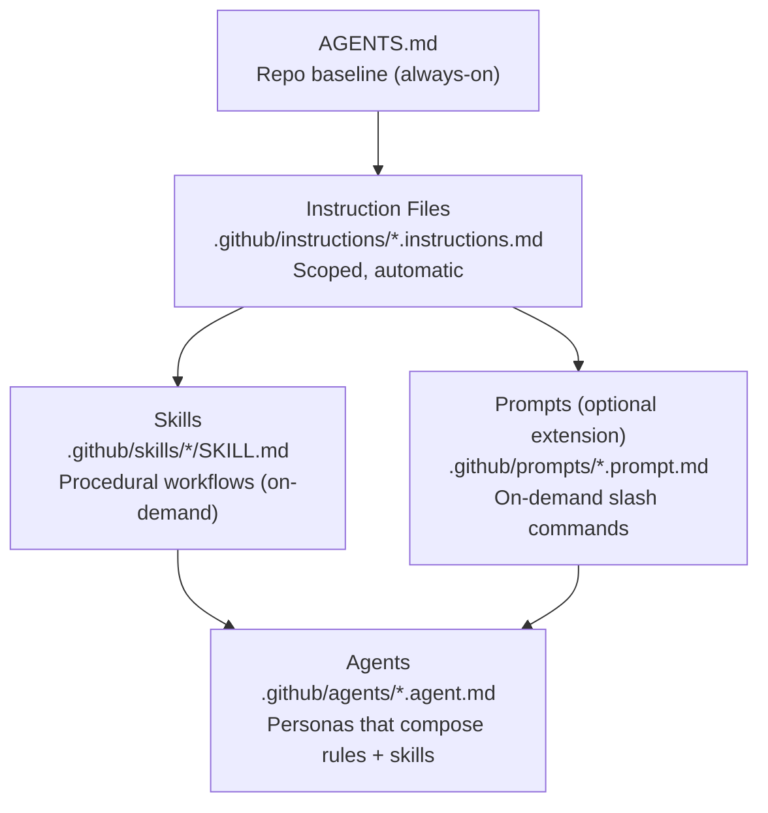
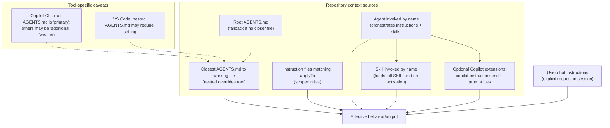

# Adoption Guide

This guide is for agency leads and program managers evaluating how to roll out agentic workflow guidance like Activate Copilot across one or more teams and repositories. It answers two questions:

1. **Which context type should I use?** — A decision-oriented overview of each file type in the Activate hierarchy, focused on tradeoffs and when to reach for one over another. [Context types](#context-types)
2. **How do I roll this out?** — Rollout patterns organized by scenario (single-team, multi-team, enterprise) and maturity stage (starting out, scaling up, optimizing). [Rollout example](#rollout-scenarios)

For a walkthrough of how a cross-functional team uses these files day-to-day, see [EXAMPLE-USAGE.md](../EXAMPLE-USAGE.md).

---

## Context Types

Activate uses five types of guidance files. Each serves a different purpose and activates differently in a developer's workflow. Understanding the tradeoffs helps you decide what to create first, what to share across teams, and what to leave for individual repos.



### AGENTS.md — Project-Wide Baseline

**Location:** Repository root  
**Activates:** Always, for every interaction in that repository

`AGENTS.md` is the foundation. It establishes the non-negotiable baseline that applies to every contributor and every AI interaction in a repo: commit conventions, branching strategy, TDD expectations, traceability requirements. Think of it as the standing order that everyone — human and AI — operates under.

**Reach for it when:**

- You need a rule to apply universally, without anyone having to invoke or configure anything
- You're establishing team norms that should travel with the repository

**Avoid putting in it:**

- Language- or tool-specific details (use instruction files instead)
- Step-by-step workflows (use skills instead)
- Anything that only applies to a subset of contributors or contexts

**Insight:** A bloated `AGENTS.md` dilutes the signal. Keep it to the conventions that are truly universal for the program.

---

### Instruction Files — Context-Specific Rules

**Location:** `.github/instructions/*.instructions.md`  
**Activates:** Automatically, when a file matching the `applyTo` glob pattern is open

Instruction files layer on top of `AGENTS.md` and activate based on what the developer is working on. A TypeScript instruction file kicks in when a `.ts` file is open. A design instruction file activates for Figma specs or component markdown. No explicit invocation required.

**Reach for them when:**

- You have rules that apply only in a specific language, framework, or file type
- You want guidance to be invisible — present when relevant, absent when not
- You're codifying patterns that already exist in the codebase (a great source: what comes up repeatedly in code review)

**Avoid putting in them:**

- Step-by-step procedures (use skills)
- Tasks that need to be invoked intentionally (use prompts)
- Rules so broad they apply to every file (that belongs in `AGENTS.md`)

**Insight:** Instruction files are the highest-leverage investment for a development team **that uses VS Code and Copilot**. They shape the AI's output every time a developer is working in a matching context, with zero friction.

---

### Prompts — Reusable On-Demand Tasks

**Location:** `.github/prompts/*.prompt.md`  
**Activates:** On-demand, invoked by the developer as `/command-name` in chat

Prompt files are reusable task templates invoked intentionally by a developer. A `/code-review` prompt runs a structured review checklist. A `/create-adr` prompt scaffolds an architecture decision record. The developer chooses when to run them.

**Reach for them when:**

- A task is repeated but not always needed (not every file edit needs a code review)
- You want a consistent, shared checklist or workflow that anyone can invoke
- The task is focused — a single, bounded output

**Avoid putting in them:**

- Multi-step workflows with branching logic (use skills)
- Always-on rules (use instruction files or `AGENTS.md`)

Prompts are a good bridge between instruction files and skills. If a task is too complex to be a standing rule but not complex enough to need a full procedural skill, a prompt is often the right fit.

---

### Skills — Procedural Methods

**Location:** `.github/skills/[skill-name]/SKILL.md`  
**Activates:** On-demand, explicitly invoked by name

Skills encode multi-step procedures that an agent executes end-to-end. They deliver the ability to perform a task with a specific outcome. Where a prompt is a focused task, a skill might encode specific steps, capabilities, and tools: "Create a new React component using TDD" involves understanding Test Driven Development (TDD) and what's important when creating tests, creating React-specific test files, implementing React-components using specific guidance, refactoring, and opening a PR. Skills can reference instruction files, call prompts and tools, and guide the agent through decision points.

**Reach for them when:**

- A task has specific context, steps, or tools that generally happen together
- You want to codify a capability or delivery process so it's reproducible across contributors.

> **Example**: All agents should work well with your issue ticketing system. A skill would allow you to define specific info about working with your tool, what's important about your ticket structure, and provide tooling access like MCP or specific scripts to make the process more directive.

**Avoid them for:**

- Simple, single-output tasks (use prompts)
- Always-on guidance (use instruction files)

Skills are the highest-effort investment but encode your team's delivery process in a way that new contributors — and AI agents — can execute consistently.

---

### Agents — Specialized Personas

**Location:** `.github/agents/[name].agent.md`  
**Activates:** Explicitly, by name (e.g., `@code-reviewer`)

Agent definitions combine a persona, a set of capabilities, and references to the instruction files, prompts, and skills that persona should use. They don't replace the other tiers — they orchestrate them. A `@code-reviewer` agent knows to load code review instructions, accessibility instructions, and the relevant skill when invoked.

**Reach for them when:**

- A role or task requires a persistent, specialized persona
- You want to compose multiple instruction files and skills into a single, named collaborator
- A task is too complex or context-rich to be a one-shot prompt

**Avoid them for:**

- Simple or one-off tasks (use prompts or skills)
- Guidance that should always be present (use `AGENTS.md` or instruction files)

Agents are the most powerful tool in the hierarchy and the last one to reach for. Build them after you have a stable foundation of instruction files and skills to compose.

---

### Choosing the Right Type

| If you want to… | Use |
|-----------------|-----|
| Set universal baseline rules for a repo | `AGENTS.md` |
| Apply rules automatically when working in a specific language or file type | Instruction file |
| Give people a reusable, on-demand command | Prompt |
| Codify a multi-step capability any agent can use | Skill |
| Create a named, specialized AI collaborator that encodes specific behaviors | Agent |



---

## Rollout Scenarios

### Single-Team Program

A single delivery team working in one (or a small number of closely related) repositories.

#### Starting out

Begin with the `activate-framework` bundle. Install `AGENTS.md` and the security and general instruction files, then customize `AGENTS.md` with your actual commit conventions, branching model, and traceability requirements. Add one or two instruction files for the languages your team works in most. Avoid adding skills or agents until your baseline conventions are stable.

*Greenfield:* Define conventions before writing code — `AGENTS.md` becomes part of the initial repo setup.  

*O&M:* Let the AI analyze existing code first. Ask it to identify patterns and naming conventions worth codifying, then write instruction files from what it finds.

```bash
Analyze this repository as an O&M codebase and identify conventions worth codifying for AI guidance. 
1. Discover recurring patterns in naming, structure, testing, error handling, security, docs, and commit/PR workflow, and cite concrete evidence (file paths + line numbers) for each pattern; do not infer without evidence.

2.  produce: (a) a table of candidate conventions with confidence (high/med/low), evidence, and recommended home (`AGENTS.md` vs `.github/instructions/*.instructions.md`), (b) a prioritized top-5 list to codify now, and (c) draft instruction files for those top items with proper frontmatter (`description`, `applyTo`) and concise actionable rules; include suggested filenames and globs. 

Keep defaults minimal, call out ambiguities/conflicts explicitly, and end with a proposed migration plan from “current state” to “codified guidance” in small safe steps.
```

#### Scaling up

Once the team trusts the baseline, layer in prompts for repeated tasks (code review, ADR creation, accessibility checks) and skills for your most common delivery workflows. Add agents when you have a clear persona need — a specialized reviewer, a documentation writer.

#### Optimizing

Treat your Activate files like code: review them in retrospectives, update instruction files when patterns change, retire prompts that aren't being used. Track which prompts and skills get invoked most and invest there first.

---

### Multi-Team Program

Multiple delivery teams sharing a product or platform, each with their own repositories but common conventions.

#### Starting out

Establish a shared `AGENTS.md` baseline in a central repository (or a shared GitHub organization profile). Each team repo inherits the baseline and can extend it locally. Focus first on the conventions that cause the most friction across teams: branching, commit format, traceability requirements.

#### Scaling up

Publish shared instruction files and prompts as a bundle from a central location. Teams pull from the shared bundle and layer in repo-specific instruction files on top.

*Greenfield:* Establish the shared bundle before teams diverge. Convention drift is much harder to reverse than to prevent.  
*O&M:* Audit existing repos for common patterns across teams before writing shared instruction files. Codify what's already working, not an ideal that doesn't reflect how code is actually written.

#### Optimizing

Run a periodic review across teams to identify instruction files or skills that belong in the shared bundle vs. staying repo-specific. Treat the shared bundle as a product with its own versioning and changelog.

---

### Enterprise / Org-Wide Rollout

A large organization with many teams, multiple programs, and varying levels of AI maturity.

#### Starting out

Establish a lightweight org-level baseline — just enough to create consistency without mandating uniformity. Focus on security and compliance-adjacent rules that apply everywhere. Use the organization's GitHub profile repository (`.github`) to distribute an `AGENTS.md` baseline and a small set of universal instruction files.

Let early-adopter teams go deeper (standard or full bundle) while other teams start minimal. Avoid mandating a specific bundle org-wide until you have evidence from real usage.

#### Scaling up

Identify patterns that have proven valuable across early-adopter teams and promote them to the org-level bundle. Establish a clear process for teams to propose additions to the shared bundle. Use automation (such as a `repository_dispatch`-based receiver workflow) to push bundle updates to downstream repos automatically.

*Greenfield programs:* Onboard to the full bundle from day one. New programs are the easiest place to establish strong conventions.  
*O&M programs:* Start with minimal and layer in incrementally. Don't attempt a full retrofit — identify the highest-friction workflows and target those first.

#### Optimizing

Treat the org bundle as a platform product. Assign ownership, maintain a changelog, and gather usage data from teams. Retire guidance that isn't being followed; tighten guidance that's causing consistent errors. The goal is a bundle that teams genuinely trust and extend — not one they route around.

---

## Cross-Cutting Considerations

### Forking vs. Referencing

When a team customizes Activate files, they can:

- **Extend** — Add repo-specific instruction files or agents on top of a shared bundle (preferred)
- **Override** — Modify shared files locally (acceptable for repo-specific needs, but document why)
- **Fork** — Maintain a fully independent copy (use sparingly; creates maintenance burden)

In general, prefer extension over overriding, and overriding over forking. The more a team diverges from the shared bundle, the more they're responsible for maintaining.

### Keeping Up With Upstream

The Activate starter kit evolves. When the upstream bundle adds new instruction files or improves existing ones, teams need a way to receive those updates without losing local customizations. Consider using a `repository_dispatch`-based receiver workflow to automate update PRs that preserve local overlays.

### When to Write Custom Files vs. Use Defaults

The default bundle is a starting point. Teams should customize when:

- The default instruction file doesn't match the frameworks or tools they actually use
- A team has a convention that differs from the default (e.g., a different branching model)
- A new workflow emerges that isn't covered by existing skills or prompts

Don't customize just to customize. The value of a shared baseline comes from consistency. Make changes when the default is wrong for your context — not just different.
